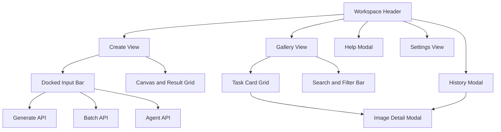

# GPT Image Playground Web UI 设计

Feature Name: web-ui-redesign
Updated: 2026-08-23

## 描述

本设计将 GPT Image Playground Web 端组织为一个以画布为中心的图片创作工作台。视觉方向采用编辑型创作工具语言：暖白背景、纸张色表面、细边框、衬线标题和紧凑的无衬线操作文本。布局优先展示图片结果，生成输入栏固定在画布下方，历史、帮助和图片详情通过弹窗进入。

## 设计目标

- 将生成结果作为页面视觉主角。
- 让单张、批量和 Agent 模式共享同一输入区域。
- 让画廊搜索、筛选、收藏和批量操作形成连续路径。
- 用清晰的视觉层级区分创作、浏览、历史和设置。
- 在现有单文件 Web 入口中完成渐进式实现。

## 信息架构

## 页面布局

### 桌面端

- 左侧导航宽度约 248px，承载品牌标记、创建、画廊、历史和设置入口。
- 主区域采用最大宽度约 1440px 的内容容器，左右保留 32px 至 48px 内边距。
- Header 位于主区域顶部，包含页面路径、服务状态、历史、帮助、刷新和连接操作。
- 页面标题位于 Header 下方，使用衬线字体和较大的字级建立创作氛围。
- 画布区域占据主要垂直空间，使用自适应网格展示任务卡片。
- 输入栏位于画布底部，采用白色浮层、细边框和轻阴影，保持当前视线附近。

### 平板端

- 左侧导航保留图标，隐藏文字标签。
- 画布采用 2 至 4 列自适应网格。
- 输入栏取消固定定位，跟随内容自然排列。
- Header 操作保留历史、帮助和刷新，连接入口进入设置视图。

### 移动端

- 导航转换为顶部横向滚动栏。
- 页面采用单列布局。
- 画廊图片采用 2 列网格。
- 输入栏按提示词、参考图、参数、提交操作顺序堆叠。
- 弹窗宽度占据可用空间，并保留 16px 至 20px 外边距。

## 视觉系统

### 色彩

| Token | 用途 | 建议值 |
| --- | --- | --- |
| `--bg` | 页面背景 | `#f7f7f5` |
| `--surface` | 卡片和弹窗表面 | `#ffffff` |
| `--surface-2` | 次级背景和控件底色 | `#f0f0ed` |
| `--ink` | 主文字和主按钮 | `#1d1d1b` |
| `--muted` | 辅助文字和元数据 | `#777873` |
| `--line` | 边框和分隔线 | `#e4e4df` |
| `--green` | 成功和在线状态 | `#3c765c` |
| `--danger` | 失败和危险操作 | `#a65145` |

### 字体

- 页面标题：`Georgia` 或系统衬线字体，强调创作和编辑属性。
- 操作文本：系统无衬线字体，确保中文和英文混排清晰。
- 标签文本：11px 至 12px，使用较高字间距和低对比度表达辅助层级。
- 任务提示词：12px 至 14px，最多两行，超出部分使用省略处理。

### 间距与圆角

- 页面基础间距：8px 倍数体系。
- 卡片圆角：12px。
- 输入控件圆角：7px 至 9px。
- 任务网格间距：10px 至 12px。
- 弹窗内边距：20px 至 24px。

## 核心组件

### Header

- 输入：当前视图、API 健康状态、当前 Profile。
- 输出：视图切换、历史弹窗、帮助弹窗、设置入口和刷新操作。
- 状态：在线、连接中、不可用。

### InputBar

- Prompt 文本区域位于主位置。
- 模式切换采用三段式控件。
- Profile、Style、Canvas、Quality 作为快捷选择。
- 参考图使用缩略图预览和移除入口。
- 高级参数折叠展示数量、Token、Background Job 和 Dry Run。
- 提交按钮按当前模式动态显示文案。

### TaskGrid

- 卡片保持统一比例，图片占据主要视觉区域。
- 收藏按钮和选择框固定在卡片角落。
- 状态标签使用文本加颜色表达。
- 卡片 hover 状态使用轻微缩放和边框强调。
- 空状态提供标题、解释文本和返回创建操作。

### DetailModal

- 顶部显示图片标题、提示词或任务模式。
- 中部显示图片预览。
- 底部提供结果序号、来源、下载、新窗口打开。
- 历史任务没有图片时隐藏图片操作并展示任务状态。
- 弹窗打开期间锁定背景滚动并限制键盘焦点范围。

### HistoryModal

- 顶部提供任务搜索输入框。
- 列表显示任务 ID、状态、提示词摘要和创建时间。
- 点击列表项打开任务详情。
- 搜索结果为空时显示明确的空状态。

## 视觉资产实现规格

- 品牌标记采用 `GI` 字母几何组合，避免依赖外部图片资源。
- 图标采用内联 SVG 或可访问文本标签，避免 Unicode 图标在不同系统中产生视觉差异。
- 空状态使用 CSS 几何图形、细线网格和低对比度块面构成。
- 状态颜色同时配合文字，确保色觉差异用户可以识别任务状态。
- 图片加载失败时显示带图标文本的占位卡片，并保留任务 ID。
- 视觉资产不引入第三方 CDN，确保本地部署和离线预览稳定。

## 交互状态

| 状态 | 视觉表现 | 用户操作 |
| --- | --- | --- |
| Ready | 中性状态点、可用主按钮 | 编辑并提交任务 |
| Running | 动态状态文字、主按钮禁用 | 查看任务进度 |
| Completed | 绿色状态、结果网格 | 查看详情、下载、收藏 |
| Failed | 红色状态文字、错误说明 | 修改参数并重试 |
| Selected | 深色轮廓和角标 | 收藏或批量移除 |
| Favorite | 星标和轻暖色背景 | 使用收藏筛选 |

## 接口映射

| UI 区域 | API |
| --- | --- |
| 单张输入栏 | `POST /v1/generate` |
| 批量输入栏 | `POST /v1/batch` |
| Agent 输入栏 | `POST /v1/agent` |
| 任务进度 | `GET /v1/jobs/{id}` |
| 历史弹窗 | `GET /v1/history` |
| 画廊网格 | `GET /v1/gallery` |
| 收藏操作 | `POST /v1/favorite` |
| 批量移除 | `POST /v1/delete-images` |
| Provider 状态 | `GET /v1/setup/status` |
| Provider 保存 | `POST /v1/setup` |

## 正确性约束

- 当前视图和导航激活状态保持一致。
- 画廊筛选结果只由当前搜索词、收藏状态和选中状态决定。
- 详情弹窗关闭后，背景滚动和先前焦点恢复。
- 历史任务详情打开时不复用上一次图片详情的图片源。
- 生成任务状态与 API 返回状态保持一致。
- API Key 输入成功保存后清空，页面 DOM 中不保留已提交密钥。

## 错误处理

- API 不可用时，Header 显示不可用状态，主操作保留可重试入口。
- 图片加载失败时显示占位卡片和资源路径摘要。
- 历史接口失败时在历史区域显示错误文本，并保留搜索控件。
- 任务失败时显示失败原因和重新提交入口。
- 空画廊和空搜索结果使用独立的空状态文案。

## 测试策略

- 使用 Node `vm.Script` 校验 Web 内嵌 JavaScript 语法。
- 使用 `git diff --check` 检查单文件 HTML/CSS/JavaScript 差异。
- 使用现有 API 测试验证生成、历史、画廊和设置接口不受 UI 改动影响。
- 使用 Provider 回归测试验证 UI 使用的 Profile 和 Provider 契约保持稳定。
- 在 1440px、980px 和 390px 宽度下检查布局、弹窗、输入栏和任务网格。
- 键盘检查覆盖 Tab、Shift+Tab、Escape 和弹窗关闭后的焦点恢复。
